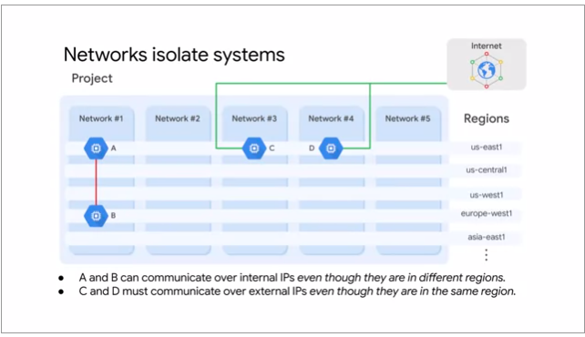
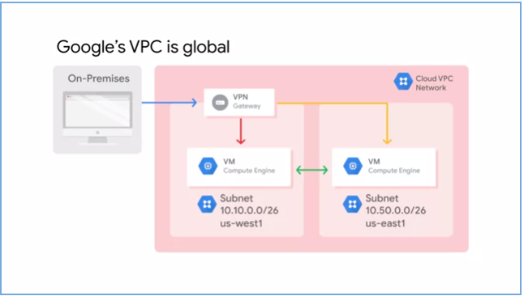
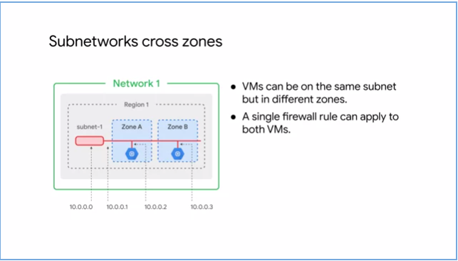
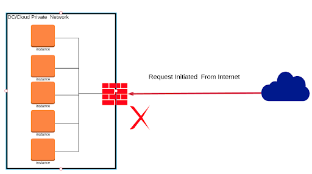
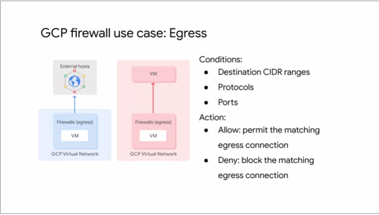
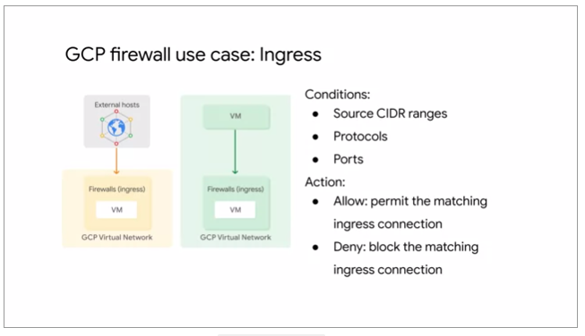

essential-gci-foundation-module1

# Essential Google Cloud Infrastructure: Foundation
## Module 1 - Introduction to GCP
* * *
### **Overview**
#### *Module Overview*
Deep dive into how to Interact with GCP both in GUI or CLI

<br/>

### **Using GCP**
#### *Using GCP*
4 ways to interact with GCP
1. GCP Console
   web based GUI
2. Cloud Shell and Cloud SDK
   browser based interactive sheldl environtment
3. REST-based API
4. Cloud Mobile App
#### *Lab: Console and Cloud Shell*
1. Create Bucket with GUI
   The name should be *globally unique*
2. Open Cloud Shell
   ```bash
   gsutil mb gs://<BUCKET_NAME>
   ```
3. Upload file through shell and put it into bucket
   ```bash
   gsutil cp [MY_FILE] gs://[BUCKET_NAME] 
   ```
   Upload the file by open up the *more* option in shell and use command   	   above to move it to our created bucket
   
4. Identify available region
   ```bash
   gcloud compute regions list
   ```
#### *Lab: Infrastructure Preview*
1. Use marketplace to build deployment using Jenkins
   Look for marketplace in menu, and serch *Jenkins Certified by Bitnami*,   	and click deploy.  
2. Examine the deployment
   click *visit the site* button and login with available email and password
3. Administer the service
   By open the *Deployment Manager* menu and click *jenkins-1*, then clisk   	SSH to connect to jenkins server
    ```bash
   gsudo /opt/bitnami/ctlscript.sh stop #to stop the service
   ```
    ```bash
   sudo /opt/bitnami/ctlscript.sh stop #to restart the service
   ```
#### *Demo: Projects*
Create new project and delete it

<br/>

### **Virtual Private Cloud**
#### *Virtual Private Cloud*
VPC or Virtual Private Cloud, is a public cloud that provides you with the ability to define and control isolated virtual networks and then deploys cloud resources into those networks. It also works on another services, not only in GCP.

Things we need to emphasize when working with VPC are:
1. Projects, Networks & Subnetworks
2. Regions & Zones
3. IP addresses
4. Routes & Firewall rules

#### *Projects, networks, and subnetworks*
- Projects

A project associates objects and services with billing. Now, it's unique that projects actually contain entire networks. The default quota for each project is five networks but you can simply request additional quota using the GCP console. These networks can be shared with other projects or they can be peered with networks in other projects. 

These networks do not have IP ranges but are simply a construct of all of the individual IP addresses and services within that network. CP networks are global spending all available regions across the world. 

So you can have one network that later exists anywhere in the world, Asia, Europe, Americas, all simultaneously. Inside a network you can segregate your resources with regional subnetworks.


Now, you can convert an auto mode network to a custom mode network to take advantage of the control that custom mode networks provide. However, this conversion is one way.

- Networks



We have an example of a project that contains five networks. All of these networks span multiple regions across the world

Each network contains separate virtual machines: A, B, C, and D. Because VM's A and B are in the same network, Network 1, they can communicate using their internal IP address even though they are in different regions. Essentially your virtual machines even if they exist in different locations across the world, take advantage of Google's global fiber network. Those Virtual Machines appear as though they're sitting in the same rack, when it comes to a network configuration protocol. VM C and D however are not in the same network. Therefore by default these VM's must communicate using their external IP addresses even though they are in the same region. 

The traffic between VM C and D isn't actually touching the public Internet but is going through the Google edge routers.




Because VM instances within a VPC network can communicate privately on a global scale, a single VPN can securely connect your on-premises network to a GCP network as shown in this diagram. Even though the two VM instances are in separate regions, US-West 1 and US-East 1, they leverage Google's private network to communicate between each other and to an on-premises network through a VPN gateway. This reduces cost and network management complexity. 

- Subnet



Subnetworks work on a regional scale. Because a region contains several zones, subnetworks can cross zones. This slide has a region, Region 1 with two zones: zones A and B. Subnetworks can extend across these zones within the same region such as subnet-1. The subnet is simply an IP address range and you can use IP addresses within that range. Notice that the first and second addresses in the range 10.0.0.0 and 10.0.0.1 are reserved for the network and these subnets gateway respectively. This makes the first and second available addresses 10.0.0.2 and 10.0.0.3 which are assigned to the VM instances. The other reserved addresses in every subnets are the second-to-last address in the range and the last address which is reserved as the broadcast address.

Now, even though the two Virtual Machines in this example are in different zones, they still communicate with each other using the same subnet IP address. This means that a single firewall rule can be applied to both VM's even though they are in different zones. 

Speaking of IP addresses of a subnet, Google Cloud VPC's let you increase the IP address space of any subnets without any workload shutdown or downtime. 

#### *Demo: Expand a Subnet*
As the title said, we're trying to seamlessly expand the range of the subnet

#### *IP Addresses*
In GCP, each virtual machine can have two IP addresses assigned. One of them is an internal IP address, which is going to be assigned via DHCP internally. Example of such services are App Engine and Kubernetes Engine. it's symbolic name is registered with an internal DNS service that translates the name to the internal IP address. DNS is scoped to the network, so it you can translate web URLs and VM names of hosts in the same network, but it can't translate host names from VMs in a different network.

The other IP address is the external IP address, but this one is optional. You can assign an external IP address if your device or your machine is externally facing. 

#### *Demo: Internal and External IP*
Procedure of managing an IP address in GCP

#### *Routes and Firewall Rules*
By default, every network has routes that let instances in a network send traffic directly to each other even across subnets. In addition, every network has a default route that directs packets to destinations that are outside the network. Although these routes cover most of your normal routing needs, you can also create special routes that overwrite these routes. 

Just creating a route does not ensure that your packet will be received by the specified next top. Firewall rules must also allow the packet. The default network has preconfigured firewall rules that allow all instances in the network to talk with each other. Manually created networks do not have such rules, so you must create them.

The virtual network router selects the next hop for a packet by consulting the routing table for that instance. GCP firewall rules to protect you virtual machine instances from unapproved connections both inbound and outbound known as ingress and egress respectively. Essentially, every VPC network functions as a distributed firewall. Although firewall rules are applied to the network as a whole, connections are allowed or denied at the instance level. You can think of the firewall as existing not only between your instances and other networks, but between individual instances within the same network. GCP firewall rules are stateful. This means that if a connection is allowed between a source and a target or a target at a destination, all subsequent traffic in either direction will be allowed. In other words, firewall rules allow bidirectional communication once a session is established.

Here Egress could be defined when If a request is made from the private network out to a public IP, the public server/endpoint responds back to that request using a port number that was defined in the request, and firewall allows that connection since its aware of an initiated session based on that port number.


*(egress image)*


Ingress refers to unsolicited traffic sent from an address in public internet to the private network – it is not a response to a request initiated by an inside system. In this case, firewalls are designed to decline this request unless there are specific policy and configuration that allows ingress connections. 


*(ingress image)*

Egress firewall rules control outgoing connections originated inside your GCP network. Egress allow rules allow outbound connections that match specific protocol ports and IP addresses. Egress deny rules prevent instances from initiating connections that match non permitted port protocol and IP range combinations. For egress firewall rules, destinations to which a rule applies may be specified using IP CIDR ranges. Specifically, you can use the destination ranges to protect from undesired connections initiated by a VM instance towards an external host as shown on the left. You can also use destination ranges to prevent undesired connections from internal VM instances to specific GCP CIDR ranges. This is illustrated in the middle, where a VM in a specific subnet is shown attempting to connect inappropriately to another VM within the same network. 





Ingress firewall rules protect against incoming connections to the instance from any source. Ingress allow rules allow specific protocol ports and IP ranges to connecting. The firewall prevents instances from receiving connections on non-permitted ports and protocols. Rules can be restricted to only affect particular sources. Source CIDR ranges can be used to protect an instance from undesired connections coming either from external networks or from GCP IP ranges. This diagram illustrates a VM receiving a connection from an external address, and another VM receiving a connection from a VM within the same network. You can control ingress connections from a VM instance by constructing inbound connection conditions using source CIDR ranges, protocols, or ports.





#### *Pricing*
Refer to the latest documentation because it could change anytime

#### *Common Network Designs*